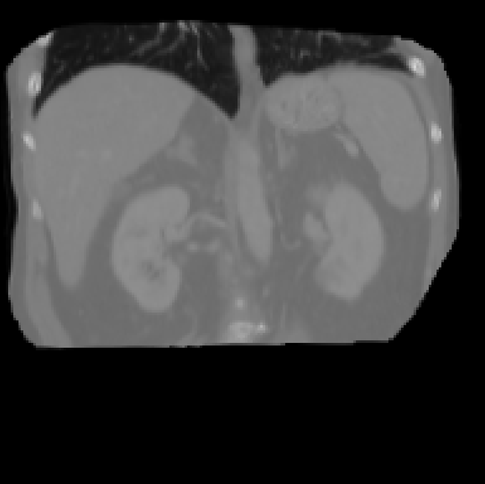
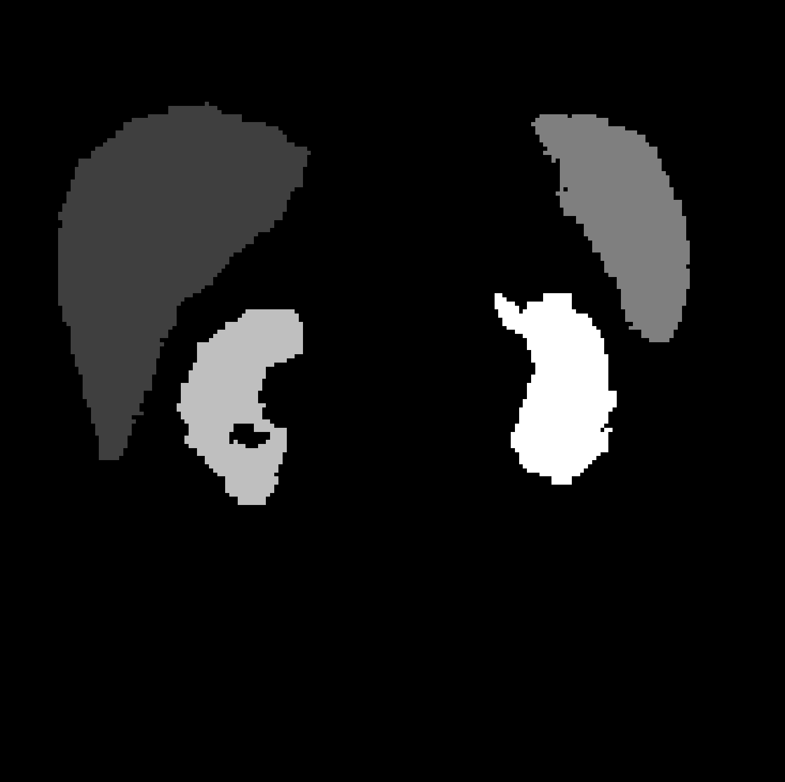
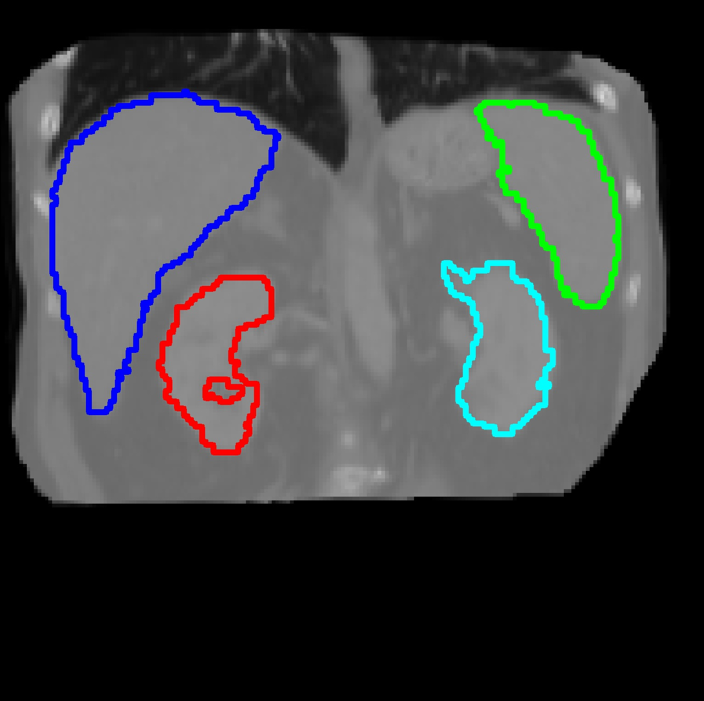

## 实验结果示例可视化

| img | seg | contour |
| --- | --- | --- |
||  |  |

我使用 `contour_with_mask.py` 将分割标签的轮廓画到图像切片上。

- 用 ITK-SNAP 选取一个好看的切片截图保存，分割标签截取同样位置的切片；
  - 参考：[使用 ITK-Snap 截取 3D 图像的一个干净的截面](https://blog.csdn.net/Run_Bomb/article/details/126401988)
  - 注意加载和保存图片的路径不能含有中文，ITK-SNAP会出错

- 在 `contour_with_mask.py` 中更改图片和标签切片的路径
  - 解注释以下代码并运行，自己选取需要画上去的 ROI
    ```python
    # 可视化辨认各个器官的分割，因为二值化后的mask值与原标签的值不一样
    plt.title(str(i))
    plt.imshow(label)
    plt.show()
    plt.pause(3)
    ...
    plt.imshow(thresh)
    plt.show()
    ``` 

- 运行会弹出绘画结果，输入法切换成英文，键盘按下 `S` 即自动保存
